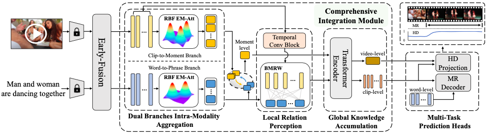

# Bridging the Gap: A Unified Video Comprehension Framework for Moment Retrieval and Highlight Detection
[Yicheng Xiao<sup>1</sup>*](https://easonxiao-888.github.io/), [Zhuoyan Luo<sup>1</sup>*](https://robertluo1.github.io/), [Yong Liu<sup>1</sup>](https://workforai.github.io/), [Yue Ma<sup>1</sup>](https://mayuelala.github.io/), [Hengwei Bian<sup>2</sup>](https://github.com/bian-hengwei), [Yatai Ji<sup>1</sup>](https://yataiji.github.io/), [Yujiu Yang<sup>1</sup>](https://sites.google.com/view/iigroup-thu/about) and [Xiu Li<sup>1</sup>](https://www.sigs.tsinghua.edu.cn/lx/main.htm)

<sup>1</sup> Tsinghua University, <sup>2</sup> Carnegie Mellon University

<a href='https://arxiv.org/pdf/2311.16464.pdf'></a> 

[](https://paperswithcode.com/sota/highlight-detection-on-youtube-highlights?p=bridging-the-gap-a-unified-video) <br>
[](https://paperswithcode.com/sota/natural-language-moment-retrieval-on-tacos?p=bridging-the-gap-a-unified-video)

[THUSIGSCLUB](https://thusigsclub.github.io/thu.github.io/index.html)


## 📖 Abstract
Video Moment Retrieval (MR) and Highlight Detection (HD) have attracted significant attention due to the growing demand for video analysis. Recent approaches treat MR and HD as similar video grounding problems and address them together with transformer-based architecture. However, we observe that the emphasis of MR and HD differs, with one necessitating the perception of local relationships and the other prioritizing the understanding of global contexts. Consequently, the lack of task-specific design will inevitably lead to limitations in associating the intrinsic specialty of two tasks. To tackle the issue, we propose a Unified Video COMprehension framework (UVCOM) to bridge the gap and jointly solve MR and HD effectively. By performing progressive integration on intra and inter-modality across multi-granularity, UVCOM achieves the comprehensive understanding in processing a video. Moreover, we present multi-aspect contrastive learning to consolidate the local relation modeling and global knowledge accumulation via well aligned multi-modal space. Extensive experiments on QVHighlights, Charades-STA, TACoS , YouTube Highlights and TVSum datasets demonstrate the effectiveness and rationality of UVCOM which outperforms the state-of-the-art methods by a remarkable margin.

---

<p align="center">
 
</p>


## 📚 Datasets
<b>QVHighlights</b> : The data is set as followed, you need to replace the feat_root path in the bash file with your own. You can download the official QVHighlight dataset from [moment_detr_features.tar.gz](https://drive.google.com/file/d/1Hiln02F1NEpoW8-iPZurRyi-47-W2_B9/view?usp=sharing). 

```txt
QVHighlight
└──── features
    ├── slowfast_features
    ├── clip_text_features
    ├── clip_features
    ├── pann_features
    └── clip_sub_features

```

## 🛠️ Environment Setup 
```txt
conda create -n uvcom python=3.7
conda activate uvcom

# Install pytorch 
pip install torch==1.9.0+cu111 torchvision==0.10.0+cu111 torchaudio==0.9.0 -f https://download.pytorch.org/whl/torch_stable.html

# Install other packages
pip install -r requirements.txt 

```
Tips: If you want to reproduce 100%, it is necessary to follow the version I provided and run it on RTX3090 ! !


## 🍺 Main Results
### QVHighlights
| Extra <br>Training <br>Data | Use <br>Audio | Set Split | MR <br> R1@0.5 | MR <br> R1@0.7 | MR mAP | HD mAP | HD HIT@1 | Log/ckpt |
| :---: | :---: | :---: | :---: | :---: | :---: | :---: | :---: | :---: |
| &cross; |  &cross; | Val   | 65.10 | 51.81 | 45.79 | 40.03 | 63.29 | [log](https://drive.google.com/file/d/1yTXlZ9OWr7T2uQ3UWIRgib1w6dkgo2rA/view?usp=sharing)/[ckpt](https://drive.google.com/file/d/1y7udpP1wQaDGpbaXZWKAAz9xv7y_zvVC/view?usp=sharing) |
| &cross; |  &cross; | Test  | 63.55 | 47.47 | 43.18 | 39.74 | 64.20 | [log](https://drive.google.com/file/d/1yTXlZ9OWr7T2uQ3UWIRgib1w6dkgo2rA/view?usp=sharing)/[ckpt](https://drive.google.com/file/d/1y7udpP1wQaDGpbaXZWKAAz9xv7y_zvVC/view?usp=sharing) |
| &cross; | &#10004; | Test | 63.18 | 48.70 | 43.27 | 39.79 | 64.79 | --/-- |
| ***ASR*** | &cross; | Test | 64.53 | 48.31 | 43.80 | 39.98 | 65.58 | --/-- |

### Charades-STA
| Extra <br>Training <br>Data  | Use <br>Audio | Set Split | MR <br> R1@0.5 | MR <br> R1@0.7 | Log/ckpt |
| :---: | :---: | :---: | :---: | :---: | :---: |
| &cross; | &cross; | Test | 59.25 | 36.64 | [log](#)/[ckpt](#) |

## 🚀 Train & Evaluate
### Train from scratch
- QVHighlights

    `bash scripts/train_QV_scratch.sh`

    You need to modify the relevant path to your own.  
### Evaluate
- QVHighlights

    `bash scripts/eval_QV_scratch.sh`
    
    You need to modify the `resume` ckpt path to your own.


## ❤️ Acknowledgement
Code in this repository is built upon several public repositories. Thanks for the wonderful work [Moment-DETR](https://github.com/jayleicn/moment_detr) and [QD-DETR](https://github.com/wjun0830/QD-DETR) ! !

## ⭐️ BibTeX
If you find this work useful for your research, please cite:
```
@article{DBLP:journals/corr/abs-2311-16464,
  author       = {Yicheng Xiao and
                  Zhuoyan Luo and
                  Yong Liu and
                  Yue Ma and
                  Hengwei Bian and
                  Yatai Ji and
                  Yujiu Yang and
                  Xiu Li},
  title        = {Bridging the Gap: {A} Unified Video Comprehension Framework for Moment
                  Retrieval and Highlight Detection},
  journal      = {CoRR},
  volume       = {abs/2311.16464},
  year         = {2023}
}
```

## ☑️ LICENSE
Our codes are under [MIT](https://opensource.org/license/MIT) license.

## 🎤🎤🎤 Todo

- [ &#10004; ] Release the code.
- [ &#10004; ] Release the config and checkpoints.
